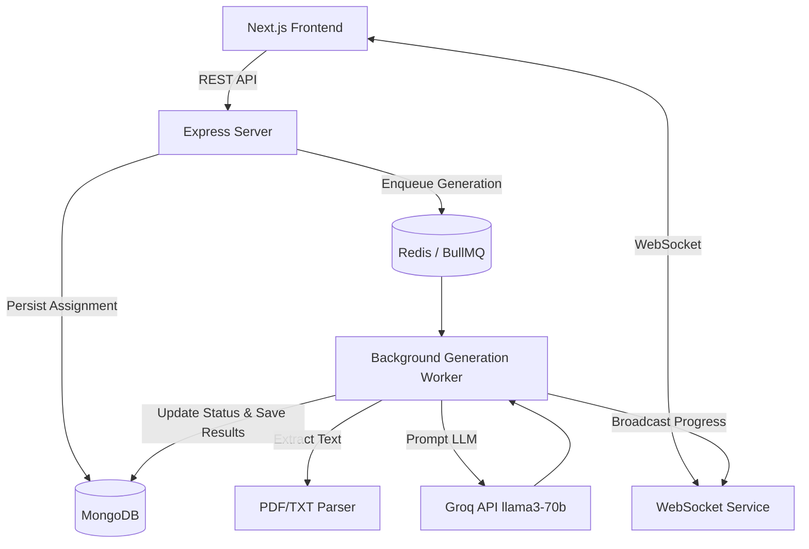

<div align="center">
  
  <h1>VedaAI Assessment Creator</h1>
  <p><strong>A Next-Generation AI Workspace for Modern Educators</strong></p>
  <p>
    
    
    
    
    
  </p>
</div>

<br />

VedaAI Assessment Creator is a full-stack, enterprise-grade AI application designed to eliminate administrative overhead for educators. By leveraging the blazing-fast Groq LLM API and an asynchronous microservice architecture, VedaAI allows teachers to generate structured examination papers, grade essays, and manage classrooms with zero friction.

## ✨ Features

- 🎯 **AI Teacher's Toolkit**
  - **📝 Essay Grader**: Instantly evaluate student essays against custom prompts with detailed feedback, strengths, and areas for improvement.
  - **📅 Lesson Planner**: Automatically generate structured, time-blocked lesson plans complete with objectives and required materials.
  - **❓ Question Generator**: Create targeted practice questions and quizzes in seconds.
  - **📊 Rubric Creator**: Standardize evaluations by instantly generating detailed grading rubrics.
- 📄 **Smart Assessment Creator**
  - Upload PDF or TXT reference materials and have the AI autonomously extract text and generate complete, ready-to-print examination papers.
- 👥 **Dynamic Classroom Management**
  - Create student groups, manage class rosters, and assign specific assessments directly from the beautiful, glassmorphic dashboard.
- ⚡ **Real-Time Progress Streaming**
  - Built on WebSockets and BullMQ, the platform streams AI generation progress directly to your UI in real-time without blocking your workflow.

## 🏗️ System Architecture

The application uses an asynchronous microservice architecture to handle long-running LLM generation tasks seamlessly.



## 💻 Tech Stack

### Frontend
* **Framework**: [Next.js 14](https://nextjs.org/) (App Router)
* **Styling**: [Tailwind CSS](https://tailwindcss.com/)
* **Animations**: [Framer Motion](https://www.framer.com/motion/)
* **State Management**: [Zustand](https://zustand-demo.pmnd.rs/)
* **Icons**: [Lucide React](https://lucide.dev/)

### Backend
* **Runtime**: [Node.js](https://nodejs.org/) & [Express](https://expressjs.com/)
* **Real-time Engine**: [Socket.io](https://socket.io/)
* **Task Queue**: [BullMQ](https://docs.bullmq.io/) backed by Redis
* **Database**: [MongoDB](https://www.mongodb.com/) via Mongoose
* **AI & Parsing**: [LangChain](https://js.langchain.com/), [Groq API](https://groq.com/), PDF-Parse

## 📂 Project Structure

This project is structured as an NPM Workspace Monorepo.

```text
assesscreator/
├── backend/                  # Express API & Background Workers
│   ├── src/
│   │   ├── config/           # MongoDB and Redis connection handlers
│   │   ├── controllers/      # REST API route handlers
│   │   ├── models/           # Mongoose Data Models (Group, Paper, etc.)
│   │   ├── routes/           # Express Routers
│   │   ├── services/         # Queue and WebSocket services
│   │   └── workers/          # BullMQ Workers and LLM integrations
│   └── package.json
├── frontend/                 # Next.js Application (App Router)
│   ├── src/
│   │   ├── app/              # Routes (Dashboard, Toolkit, Groups, etc.)
│   │   ├── components/       # Reusable React UI Components
│   │   ├── hooks/            # Custom Hooks (WebSocket Client)
│   │   └── store/            # Zustand global state management
│   └── package.json
├── packages/                 
│   └── shared/               # Shared Zod Schemas & TypeScript Types
├── Dockerfile                # Configured for Hugging Face Spaces
├── start.sh                  # Bootstraps Mongo, Redis, and Node apps
└── docker-compose.yml        # Local development orchestration
```

## 🚀 Deployment

This repository is optimized to run fully self-contained on **Hugging Face Spaces** (Docker SDK). The provided `Dockerfile` and `start.sh` scripts automatically provision the internal MongoDB and Redis daemons within the container, ensuring a one-click deployment without needing external database providers.

To run locally using Docker Compose:
```bash
docker-compose up --build
```

---
*Built with ❤️ for modern educators.*
