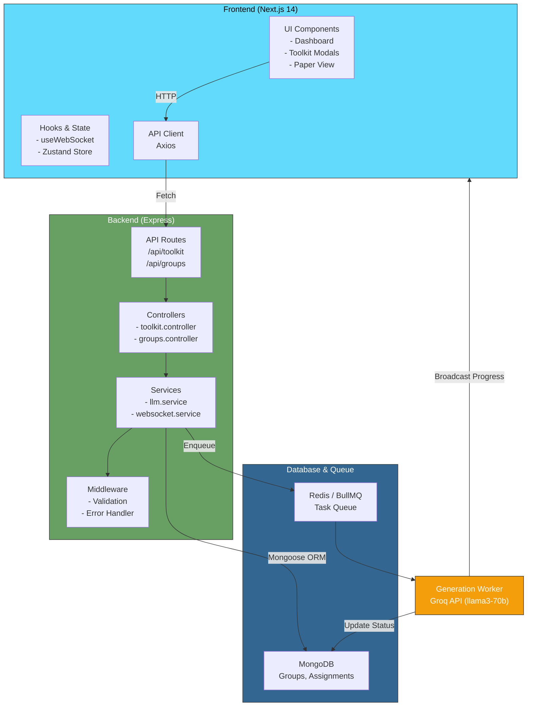

A modern, full-stack AI application for generating custom examination papers, grading essays, and managing classrooms with real-time generation status tracking. Built with React, Next.js, Node.js, Express, MongoDB, and Redis.

## Features
- **Assessment Generation**: Create structured examination papers from PDF or TXT references
- **Teacher Toolkit**: Generate lesson plans, grading rubrics, quizzes, and instantly grade student essays
- **Group Management**: Create student groups, manage rosters, and organize classes
- **Real-time Progress**: WebSockets stream generation status directly to the UI
- **Asynchronous Processing**: Heavy LLM tasks are processed in the background using BullMQ
- **Secure API**: Input validation, error boundary protection, and robust error handling
- **Docker Support**: Complete containerization optimized for Hugging Face Spaces

## Architecture


```
assesscreator/
├── backend/                          # Node.js Express API
│   ├── src/
│   │   ├── index.ts                 # Server entry point
│   │   ├── controllers/             
│   │   │   ├── groups.controller.ts # Group request handlers
│   │   │   └── toolkit.controller.ts# AI Toolkit handlers
│   │   ├── services/
│   │   │   ├── llm.service.ts       # AI prompt logic
│   │   │   └── websocket.service.ts # Socket.io broadcasting
│   │   ├── routes/
│   │   │   ├── groups.ts            # /api/groups routes
│   │   │   └── toolkit.ts           # /api/toolkit routes
│   │   ├── config/
│   │   │   ├── db.ts                # MongoDB connection
│   │   │   └── redis.ts             # Redis connection
│   │   └── models/
│   │       ├── Group.model.ts       # Mongoose schemas
│   │       └── Assignment.model.ts
│   ├── workers/
│   │   └── generation.worker.ts     # BullMQ background worker
│   └── package.json
│
├── frontend/                        # Next.js SPA
│   ├── src/
│   │   ├── app/                     # App Router pages
│   │   │   ├── assignments/         # Paper and status views
│   │   │   ├── groups/              # Group management
│   │   │   └── toolkit/             # AI mini-tools
│   │   ├── components/
│   │   │   ├── form/                # Reusable inputs
│   │   │   ├── layout/              # Sidebar & Navigation
│   │   │   └── paper/               # Examination paper UI
│   │   ├── store/
│   │   │   └── paperStore.ts        # Zustand state
│   │   └── hooks/
│   │       └── useGlobalSocket.ts   # Socket hook
│   └── package.json
│
├── packages/
│   └── shared/                      # Shared TS interfaces
├── Dockerfile                       # Hugging Face deployment image
├── start.sh                         # Bootstrap script
├── docker-compose.yml               # Local environment
└── package.json                     # Root workspace config
```

### Prerequisites
- Node.js 20+
- Docker & Docker Compose
- Git
- Groq API Key

### Using Docker Compose (Recommended)
```bash
# Clone repository
git clone https://github.com/BugHunterX2101/assesscreator.git
cd assesscreator

# Setup environment variables
cp .env.example .env

# Build and start all services
docker compose up --build

# Open http://localhost:3000 in your browser
```

### Local Development
```bash
# 1. Install dependencies
npm install

# 2. Setup environment
cp .env.example .env

# 3. Start MongoDB and Redis using Docker
docker run --name vedaai-mongo -p 27017:27017 -d mongo:latest
docker run --name vedaai-redis -p 6379:6379 -d redis:latest

# 4. Start servers in separate terminals
# Terminal 1: Backend
npm run dev --workspace=backend

# Terminal 2: Frontend  
npm run dev --workspace=frontend
```

### Groups API
- `GET /api/groups` - List all groups
- `POST /api/groups` - Create new group
- `POST /api/groups/:id/students` - Add student to a group

### Toolkit API
- `POST /api/toolkit/generate-lesson-plan` - Generate lesson plan
- `POST /api/toolkit/grade-essay` - Grade student essay
- `POST /api/toolkit/generate-questions` - Generate quizzes
- `POST /api/toolkit/generate-rubric` - Create grading rubric

- **Asynchronous Queue** - Heavy LLM generation happens in the background via BullMQ to prevent HTTP timeouts
- **WebSockets** - Real-time progress percentage streaming
- **Input Validation** - Sanitizes all user inputs
- **Graceful Shutdown** - Properly closes DB and Redis connections
- **Environment Variables** - Validates required env vars at startup

### Groups Collection
```javascript
{
  _id: ObjectId,
  name: String (required),
  students: [
    {
      name: String,
      addedAt: Date
    }
  ],
  createdAt: Date,
  updatedAt: Date
}
```

### Assignments Collection
```javascript
{
  _id: ObjectId,
  title: String (required),
  status: String (enum: "pending", "processing", "completed", "failed"),
  progress: Number,
  questions: Array,
  createdAt: Date
}
```

## Technologies
| Component | Tech Stack |
|-----------|-----------|
| **Frontend** | Next.js 14, React, Tailwind CSS, Zustand |
| **Backend** | Express, Node.js 20 |
| **Database** | MongoDB, Mongoose |
| **Queue & Cache** | BullMQ, Redis |
| **AI Integration** | Groq API (llama3), LangChain |
| **Real-time** | Socket.io |
| **Deployment** | Docker, Docker Compose |

## Environment Variables
```bash
# Backend / General
GROQ_API_KEY=your_groq_api_key
MONGODB_URI=mongodb://localhost:27017/assesscreator
REDIS_URL=redis://localhost:6379
PORT=3001

# Frontend
NEXT_PUBLIC_API_BASE_URL=http://localhost:3001
```

## Generation Statuses
- **Pending** - Task added to Redis queue
- **Processing** - Worker is communicating with Groq API
- **Completed** - Assessment successfully generated and saved
- **Failed** - Error occurred during text extraction or generation

## Development Workflow
1. Create a feature branch: `git checkout -b feature/your-feature`
2. Make changes and verify build: `npm run build --workspaces`
3. Commit: `git commit -m "feat: description"`
4. Push: `git push origin feature/your-feature`
5. Open pull request on GitHub

## Scripts
```bash
# Root
npm run install      # Install all workspaces
npm run build        # Build all workspaces

# Frontend
npm run dev --workspace=frontend
npm run build --workspace=frontend

# Backend
npm run dev --workspace=backend
npm run build --workspace=backend

# Docker
docker compose up --build    # Start all services
docker compose down          # Stop all services
```

## Known Issues and TODO
- Add authentication and user accounts
- Implement PDF export for generated papers
- Add soft deletes for audit trail
- Implement API rate limiting

## Contact and Support
For issues, questions, or contributions, please:
- Open an [issue](https://github.com/BugHunterX2101/assesscreator/issues)
- Submit a [pull request](https://github.com/BugHunterX2101/assesscreator/pulls)

## Contributors
This project is maintained by the following contributors:

- BugHunterX2101 <veditagrawal21@gmail.com>

## License
MIT License - see LICENSE file for details

---

**Built for modern educators**

Last updated: May 2026
