# Technical Design Document
## VedaAI — AI Assessment Creator
**Version:** 1.0  
**Date:** May 27, 2026  
**Status:** Draft  
**Audience:** Full Stack Engineers, Tech Lead, DevOps

---

## Table of Contents

1. Tech Stack
2. Repository Structure
3. System Architecture Diagram
4. Data Flow Diagrams
5. Component Architecture
6. Database Schema
7. API Design
8. WebSocket Protocol
9. State Management Design
10. AI Layer Design
11. Infrastructure & DevOps
12. Environment Configuration
13. Key Technical Decisions

---

## 1. Tech Stack

### Frontend

| Category | Library / Tool | Version | Reason |
|---|---|---|---|
| Framework | Next.js (App Router) | 14.x | SSR + file-based routing; ideal for SEO on output page |
| Language | TypeScript | 5.x | Type safety across components, stores, API calls |
| State Management | Zustand | 4.x | Lightweight, no boilerplate; supports slices pattern |
| Styling | Tailwind CSS | 3.x | Utility-first; fast to match Figma spacing/color tokens |
| Form Validation | React Hook Form + Zod | latest | Schema-first validation; pairs with Zustand cleanly |
| HTTP Client | Axios | 1.x | Interceptors for auth headers + error normalisation |
| WebSocket Client | Native `WebSocket` API | — | No extra dependency; wrapped in custom hook |
| PDF Export (Bonus) | `@react-pdf/renderer` | 3.x | React-native DSL for PDF; better than Puppeteer for client |
| Icons | Lucide React | latest | Consistent, tree-shakeable icon set |
| Animations | Framer Motion | 10.x | Question item entry animations on output page |
| Testing | Jest + React Testing Library | latest | Unit + integration tests |
| Linting | ESLint + Prettier | latest | Enforced code style |

### Backend

| Category | Library / Tool | Version | Reason |
|---|---|---|---|
| Runtime | Node.js | 20 LTS | Stable LTS; required by BullMQ |
| Framework | Express | 4.x | Minimal, well-understood; easy to type with TypeScript |
| Language | TypeScript | 5.x | End-to-end type safety with shared types package |
| ODM | Mongoose | 8.x | Schema validation + middleware hooks for MongoDB |
| Job Queue | BullMQ | 5.x | Redis-backed; supports retries, backoff, concurrency |
| WebSocket Server | `ws` | 8.x | Lightweight; no Socket.IO overhead needed |
| File Upload | Multer | 1.x | Multipart handling; integrates with file size limits |
| PDF Text Extraction | `pdf-parse` | 1.x | Extract text from teacher-uploaded reference PDFs |
| Validation | Zod | 3.x | Shared schemas with frontend via `packages/shared` |
| Rate Limiting | `express-rate-limit` | 7.x | Protect `/api/assignments` from abuse |
| Logging | Pino | 8.x | Structured JSON logs; low overhead |
| Testing | Jest + Supertest | latest | API integration tests |

### Infrastructure

| Category | Tool | Reason |
|---|---|---|
| Database | MongoDB 7 | Document model fits flexible question structures |
| Cache + Queue Broker | Redis 7 | BullMQ dependency; also used for paper + job caching |
| Containerisation | Docker + Docker Compose | Reproducible local dev; same config in CI |
| CI/CD | GitHub Actions | Lint, test, build on every PR |
| Hosting (suggested) | Vercel (frontend) + Railway / Render (backend) | Fast deployment; free tier available |

### AI

| Category | Tool | Reason |
|---|---|---|
| Primary LLM | Anthropic Claude 3.5 Sonnet | Fast, strong instruction-following, JSON mode reliable |
| Fallback LLM | OpenAI GPT-4o | Secondary if Anthropic quota exceeded |
| SDK | `@anthropic-ai/sdk` | Official; handles streaming + retries |

---

## 2. Repository Structure

Monorepo using **npm workspaces**. Three top-level packages: `frontend`, `backend`, `packages/shared`.

```
vedaai/
├── .github/
│   └── workflows/
│       ├── ci.yml                  # lint + test on PR
│       └── deploy.yml              # deploy on merge to main
│
├── packages/
│   └── shared/                     # Shared TypeScript types + Zod schemas
│       ├── src/
│       │   ├── types/
│       │   │   ├── assignment.ts   # AssignmentFormData, Assignment
│       │   │   ├── paper.ts        # GeneratedPaper, Section, Question
│       │   │   └── events.ts       # WebSocket event types
│       │   └── schemas/
│       │       ├── assignment.schema.ts   # Zod schema for form payload
│       │       └── paper.schema.ts        # Zod schema for LLM output
│       ├── package.json
│       └── tsconfig.json
│
├── frontend/
│   ├── public/
│   │   └── fonts/
│   ├── src/
│   │   ├── app/                          # Next.js App Router
│   │   │   ├── layout.tsx               # Root layout, providers
│   │   │   ├── page.tsx                 # Redirects to /create
│   │   │   ├── create/
│   │   │   │   └── page.tsx             # Assignment creation form
│   │   │   └── assignments/
│   │   │       └── [id]/
│   │   │           ├── status/
│   │   │           │   └── page.tsx     # Job progress / loading page
│   │   │           └── paper/
│   │   │               └── page.tsx     # Generated question paper
│   │   │
│   │   ├── components/
│   │   │   ├── form/
│   │   │   │   ├── AssignmentForm.tsx
│   │   │   │   ├── QuestionTypeRow.tsx  # Count + marks inputs per type
│   │   │   │   ├── DifficultySlider.tsx
│   │   │   │   ├── FileUploader.tsx
│   │   │   │   └── FormField.tsx        # Reusable labelled input wrapper
│   │   │   ├── paper/
│   │   │   │   ├── PaperHeader.tsx
│   │   │   │   ├── StudentInfoSection.tsx
│   │   │   │   ├── SectionBlock.tsx
│   │   │   │   ├── QuestionItem.tsx
│   │   │   │   ├── DifficultyBadge.tsx
│   │   │   │   └── ActionBar.tsx
│   │   │   ├── status/
│   │   │   │   ├── StatusCard.tsx
│   │   │   │   └── ProgressBar.tsx
│   │   │   └── ui/                      # Generic primitives
│   │   │       ├── Button.tsx
│   │   │       ├── Input.tsx
│   │   │       ├── Select.tsx
│   │   │       ├── Badge.tsx
│   │   │       └── Spinner.tsx
│   │   │
│   │   ├── store/
│   │   │   ├── assignmentStore.ts       # Zustand store: form + job state
│   │   │   └── paperStore.ts            # Zustand store: generated paper
│   │   │
│   │   ├── hooks/
│   │   │   ├── useAssignmentSocket.ts   # WS connection + event dispatch
│   │   │   ├── useAssignmentForm.ts     # RHF + Zod integration
│   │   │   └── usePaperExport.ts        # PDF export logic
│   │   │
│   │   ├── lib/
│   │   │   ├── api.ts                   # Axios instance + typed API calls
│   │   │   └── constants.ts             # Question types, difficulty labels
│   │   │
│   │   └── styles/
│   │       └── globals.css
│   │
│   ├── .env.local
│   ├── next.config.ts
│   ├── tailwind.config.ts
│   ├── tsconfig.json
│   └── package.json
│
├── backend/
│   ├── src/
│   │   ├── index.ts                     # Entry point: Express + WS server
│   │   │
│   │   ├── config/
│   │   │   ├── db.ts                    # Mongoose connection
│   │   │   ├── redis.ts                 # Redis client (ioredis)
│   │   │   └── env.ts                   # Validated env vars (Zod)
│   │   │
│   │   ├── routes/
│   │   │   ├── assignments.routes.ts    # POST, GET /api/assignments
│   │   │   ├── paper.routes.ts          # GET /api/assignments/:id/paper
│   │   │   └── upload.routes.ts         # POST /api/upload
│   │   │
│   │   ├── controllers/
│   │   │   ├── assignments.controller.ts
│   │   │   ├── paper.controller.ts
│   │   │   └── upload.controller.ts
│   │   │
│   │   ├── services/
│   │   │   ├── assignment.service.ts    # Business logic: create, update
│   │   │   ├── paper.service.ts         # Fetch from cache or DB
│   │   │   ├── queue.service.ts         # BullMQ producer: enqueue jobs
│   │   │   └── websocket.service.ts     # WS room management + emit
│   │   │
│   │   ├── workers/
│   │   │   ├── generation.worker.ts     # BullMQ worker: orchestrates job
│   │   │   ├── llm.service.ts           # Prompt builder + LLM API call
│   │   │   └── parser.service.ts        # JSON parse + Zod validation
│   │   │
│   │   ├── models/
│   │   │   ├── Assignment.model.ts      # Mongoose model
│   │   │   └── GeneratedPaper.model.ts  # Mongoose model
│   │   │
│   │   ├── middleware/
│   │   │   ├── validate.ts              # Zod req body validation
│   │   │   ├── rateLimiter.ts           # express-rate-limit config
│   │   │   ├── errorHandler.ts          # Global error middleware
│   │   │   └── upload.ts                # Multer config
│   │   │
│   │   └── types/
│   │       └── express.d.ts             # Express Request augmentations
│   │
│   ├── .env
│   ├── tsconfig.json
│   └── package.json
│
├── docker-compose.yml               # MongoDB + Redis for local dev
├── package.json                     # npm workspaces root
├── turbo.json                       # Turborepo pipeline (optional)
└── README.md
```

---

## 3. System Architecture Diagram

### 3.1 High-Level System Architecture

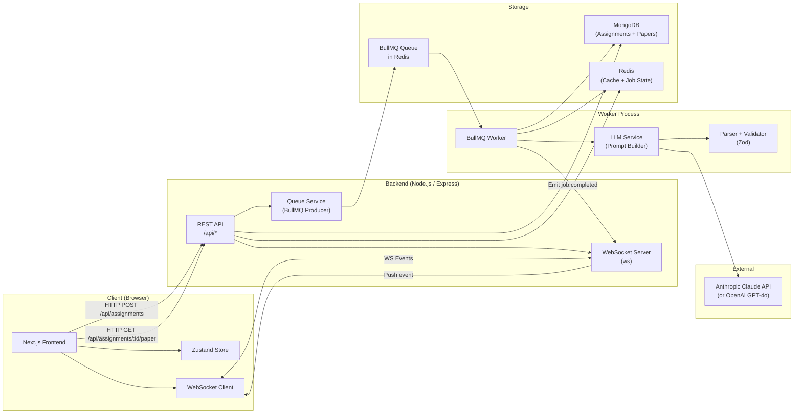

### 3.2 Request Lifecycle — Assignment Creation

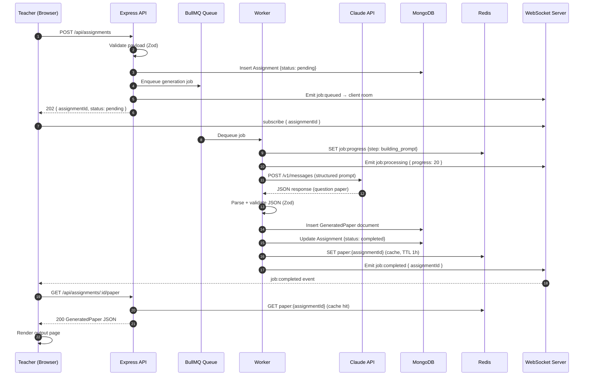

### 3.3 WebSocket Connection Lifecycle

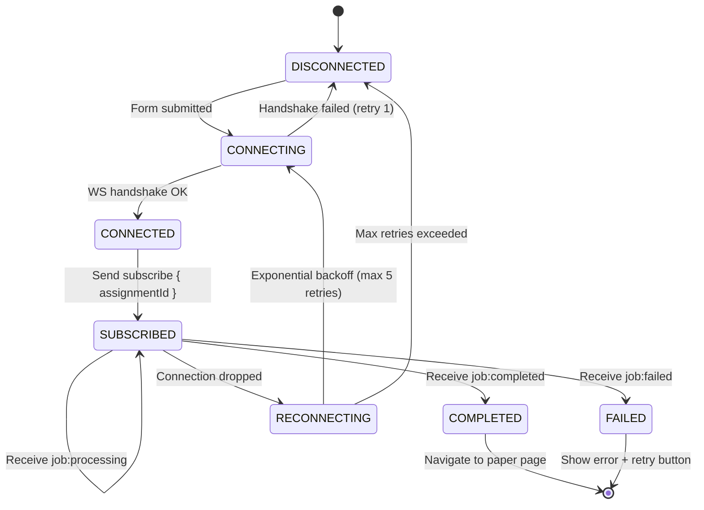

### 3.4 BullMQ Worker — Job State Machine

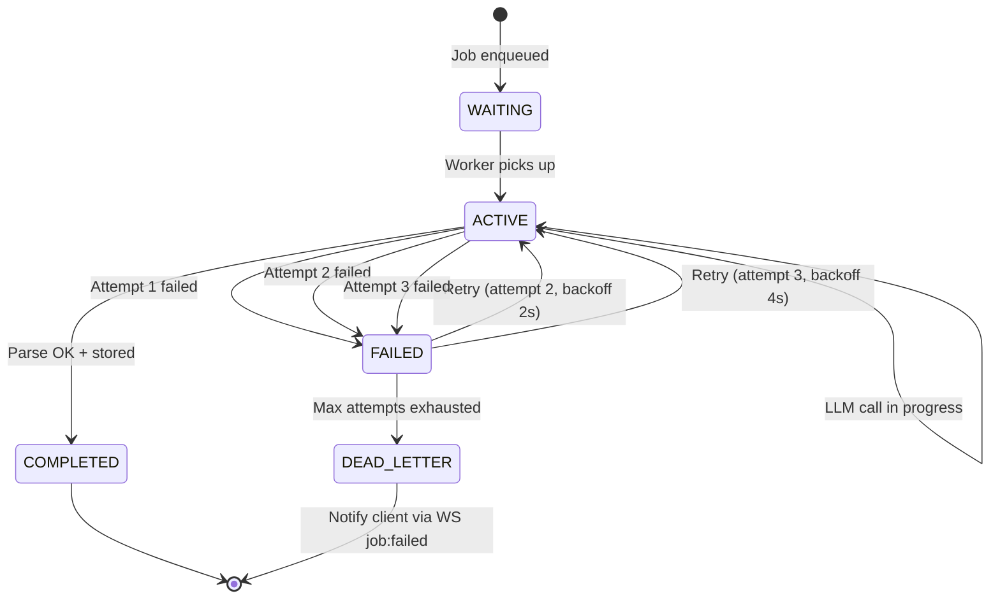

---

## 4. Data Flow Diagrams

### 4.1 File Upload + Reference Text Extraction

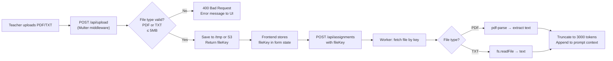

### 4.2 Redis Caching Strategy

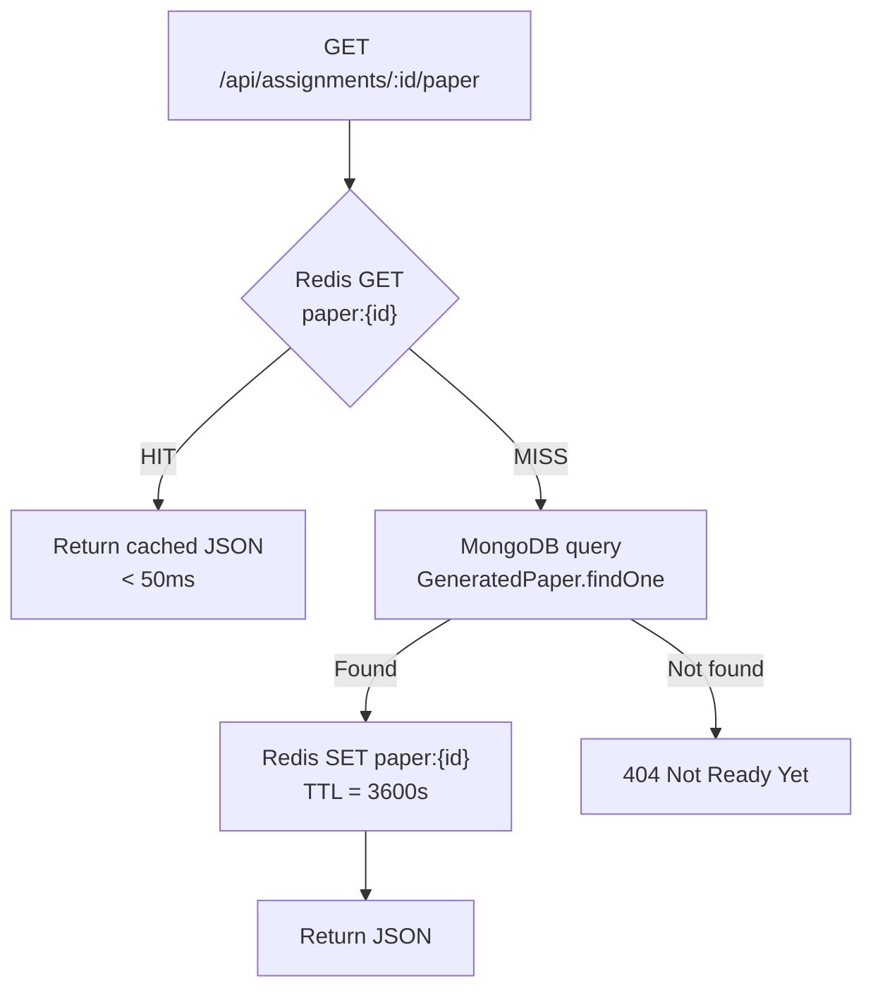

---

## 5. Component Architecture

### 5.1 Frontend Component Hierarchy

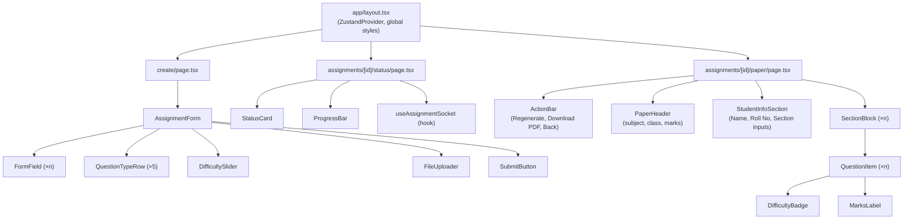

### 5.2 Zustand Store Slices

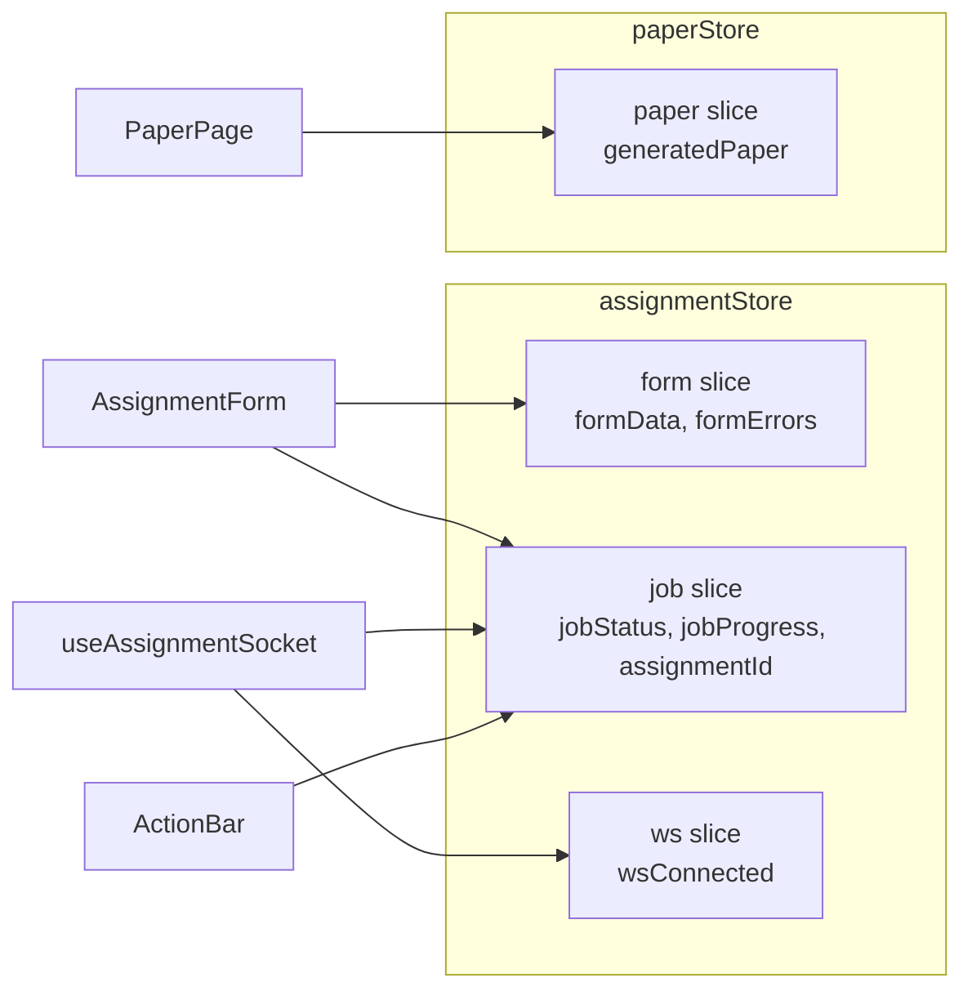

---

## 6. Database Schema

### 6.1 MongoDB Collection: `assignments`

```typescript
{
  _id:             ObjectId,
  title:           String,       // "Mathematics Chapter 5 Test"
  subject:         String,       // "Mathematics"
  topic:           String,       // "Quadratic Equations"
  grade:           String,       // "Class 10"
  dueDate:         Date,
  questionTypes: [{
    type:          String,       // "MCQ" | "ShortAnswer" | "LongAnswer" | "TrueFalse" | "FillBlank"
    count:         Number,       // min: 1
    marksEach:     Number        // min: 1
  }],
  difficulty: {
    easy:          Number,       // percentage 0–100
    medium:        Number,
    hard:          Number        // easy + medium + hard must = 100
  },
  instructions:    String,       // optional
  referenceFileKey: String,      // optional S3/local path
  status:          String,       // "pending" | "processing" | "completed" | "failed"
  jobId:           String,       // BullMQ job ID
  createdAt:       Date,
  updatedAt:       Date
}

// Indexes:
// { status: 1 }
// { createdAt: -1 }
```

### 6.2 MongoDB Collection: `generated_papers`

```typescript
{
  _id:             ObjectId,
  assignmentId:    ObjectId,     // ref: assignments
  title:           String,
  subject:         String,
  grade:           String,
  timeAllowed:     String,       // e.g. "2 Hours" (derived)
  totalMarks:      Number,
  sections: [{
    id:            String,       // "A", "B", "C"
    title:         String,       // "Section A — Multiple Choice Questions"
    instruction:   String,       // "Attempt all questions"
    questions: [{
      number:      Number,
      text:        String,
      type:        String,       // "MCQ" | "ShortAnswer" etc.
      difficulty:  String,       // "easy" | "medium" | "hard"
      marks:       Number
    }]
  }],
  version:         Number,       // increments on regenerate, default: 1
  generatedAt:     Date
}

// Indexes:
// { assignmentId: 1 }
// { assignmentId: 1, version: -1 }  (fetch latest version)
```

### 6.3 Redis Key Reference

| Key | Type | Value | TTL |
|---|---|---|---|
| `paper:{assignmentId}` | String | Serialised `GeneratedPaper` JSON | 3600s |
| `job:progress:{assignmentId}` | String | `{ step: string, progress: number }` | 3600s |
| `prompt:cache:{hash}` | String | Serialised `GeneratedPaper` JSON (bonus) | 86400s |
| `bullmq:*` | — | Managed by BullMQ internally | — |

---

## 7. API Design

### Base URL
```
http://localhost:3001/api
```

### Endpoints

#### `POST /assignments`
Create an assignment and enqueue a generation job.

**Headers:** `Content-Type: application/json`

**Request:**
```typescript
{
  title:         string;          // required
  subject:       string;          // required
  topic:         string;          // required
  grade:         string;          // required
  dueDate:       string;          // ISO 8601, must be future date
  questionTypes: {
    type:        QuestionType;
    count:       number;          // min 1
    marksEach:   number;          // min 1
  }[];
  difficulty: {
    easy:        number;          // 0–100, sum must = 100
    medium:      number;
    hard:        number;
  };
  instructions?: string;          // optional, max 500 chars
  referenceFileKey?: string;      // optional, from /upload
}
```

**Response 202:**
```json
{ "assignmentId": "64f1a2b3...", "status": "pending" }
```

---

#### `GET /assignments/:id`
Fetch assignment metadata and current job status.

**Response 200:**
```json
{
  "assignmentId": "64f1a2b3...",
  "status": "processing",
  "progress": 60,
  "createdAt": "2026-05-27T10:00:00Z"
}
```

---

#### `GET /assignments/:id/paper`
Fetch generated paper (Redis cache → MongoDB fallback).

**Response 200:** Full `GeneratedPaper` object.  
**Response 404:** `{ "error": { "code": "NOT_READY", "message": "Paper not yet generated" } }`

---

#### `POST /assignments/:id/regenerate`
Re-enqueue generation for an existing assignment config. Optionally accepts feedback.

**Request:**
```json
{ "feedback": "Make the long-answer questions harder" }
```

**Response 202:**
```json
{ "assignmentId": "64f1a2b3...", "status": "pending", "version": 2 }
```

**Response 409:** If the assignment is already `processing`.

---

#### `POST /upload`
Upload a reference file (PDF or TXT).

**Request:** `multipart/form-data` with field `file`.  
**Response 200:**
```json
{ "fileKey": "uploads/2026/05/abc123.pdf" }
```
**Response 400:** If wrong MIME type or file > 5MB.

---

#### `GET /health`
Health check endpoint for uptime monitoring.

**Response 200:**
```json
{
  "status": "ok",
  "mongo": "connected",
  "redis": "connected",
  "queue": "ready"
}
```

---

### Error Response Shape (all endpoints)
```json
{
  "error": {
    "code": "VALIDATION_ERROR",
    "message": "dueDate must be a future date",
    "details": { "field": "dueDate" }
  }
}
```

| Code | HTTP Status |
|---|---|
| `VALIDATION_ERROR` | 400 |
| `NOT_FOUND` | 404 |
| `NOT_READY` | 404 |
| `CONFLICT` | 409 |
| `GENERATION_FAILED` | 500 |
| `INTERNAL_ERROR` | 500 |

---

## 8. WebSocket Protocol

### Connection URL
```
ws://localhost:3001/ws?assignmentId={id}
```

The `assignmentId` query param auto-subscribes the client to that room on connect, as an alternative to sending a `subscribe` message.

### Message Format (both directions)
```typescript
interface WSMessage {
  event: string;
  payload: Record<string, unknown>;
}
```

### Client → Server Messages

| Event | Payload | Notes |
|---|---|---|
| `subscribe` | `{ assignmentId: string }` | Join room for this assignment |
| `unsubscribe` | `{ assignmentId: string }` | Leave room |
| `ping` | `{}` | Keepalive |

### Server → Client Messages

| Event | Payload | Frontend Action |
|---|---|---|
| `job:queued` | `{ assignmentId }` | Show "Queued" status |
| `job:processing` | `{ assignmentId, progress: number, step: string }` | Update progress bar |
| `job:completed` | `{ assignmentId }` | Fetch paper + navigate to `/paper` |
| `job:failed` | `{ assignmentId, error: string }` | Show error + retry button |
| `pong` | `{}` | Keepalive acknowledgement |

### Reconnection Strategy (Frontend)
```
Attempt 1: wait 1s
Attempt 2: wait 2s
Attempt 3: wait 4s
Attempt 4: wait 8s
Attempt 5: wait 16s
After attempt 5: show "Connection lost" message; offer manual refresh
```
While disconnected, fall back to polling `GET /api/assignments/:id` every 3 seconds.

---

## 9. State Management Design

### Store: `assignmentStore` (Zustand)

```typescript
// frontend/src/store/assignmentStore.ts

interface AssignmentFormData {
  title:            string;
  subject:          string;
  topic:            string;
  grade:            string;
  dueDate:          string;
  questionTypes:    QuestionTypeConfig[];
  difficulty:       { easy: number; medium: number; hard: number };
  instructions:     string;
  referenceFileKey: string | null;
}

interface AssignmentState {
  // Form
  form:               AssignmentFormData;
  formErrors:         Partial<Record<keyof AssignmentFormData, string>>;
  isDirty:            boolean;

  // Job
  currentAssignmentId: string | null;
  jobStatus:           'idle' | 'pending' | 'processing' | 'completed' | 'failed';
  jobProgress:         number;
  jobStep:             string;
  jobError:            string | null;

  // WS
  wsConnected:         boolean;

  // Actions
  updateForm:          (patch: Partial<AssignmentFormData>) => void;
  setFormError:        (field: keyof AssignmentFormData, msg: string) => void;
  clearFormErrors:     () => void;
  submitAssignment:    () => Promise<void>;
  setJobStatus:        (status: JobStatus, progress?: number, step?: string) => void;
  setWsConnected:      (v: boolean) => void;
  reset:               () => void;
}
```

### Store: `paperStore` (Zustand)

```typescript
// frontend/src/store/paperStore.ts

interface PaperState {
  paper:          GeneratedPaper | null;
  isLoading:      boolean;
  error:          string | null;
  studentName:    string;
  studentRollNo:  string;
  studentSection: string;

  setPaper:           (p: GeneratedPaper) => void;
  setStudentInfo:     (field: 'studentName' | 'studentRollNo' | 'studentSection', v: string) => void;
  fetchPaper:         (assignmentId: string) => Promise<void>;
  clearPaper:         () => void;
}
```

### Data Flow (Form Submit → Paper Render)

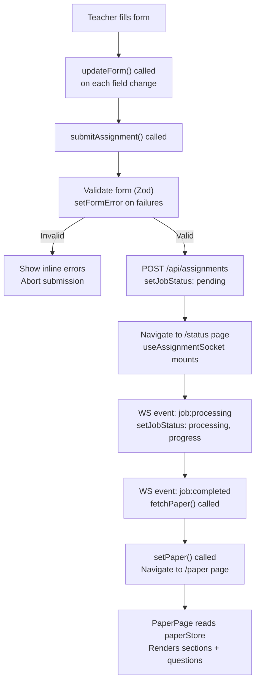

---

## 10. AI Layer Design

### Prompt Architecture

The `llm.service.ts` constructs the prompt from discrete builder functions, not a string template, to make it testable and composable:

```typescript
buildSystemPrompt()         → string  // Educator role, JSON-only instruction
buildAssignmentContext(form) → string  // Subject, topic, grade, instructions
buildQuestionSpec(form)     → string  // Per-type: count, marks, difficulty split
buildReferenceContext(text?) → string  // Optional: truncated reference file content
buildOutputSchema()         → string  // JSON schema the model must follow
```

These are assembled in `generatePrompt(form, referenceText?)` and passed as the `user` message. The `system` message instructs the model to return only valid JSON with no prose.

### Expected LLM Output Schema (Zod)

```typescript
const QuestionSchema = z.object({
  number:     z.number().int().positive(),
  text:       z.string().min(10),
  type:       z.enum(['MCQ','ShortAnswer','LongAnswer','TrueFalse','FillBlank']),
  difficulty: z.enum(['easy','medium','hard']),
  marks:      z.number().int().positive()
});

const SectionSchema = z.object({
  id:          z.string(),                    // "A", "B", etc.
  title:       z.string(),
  instruction: z.string(),
  questions:   z.array(QuestionSchema).min(1)
});

const GeneratedPaperSchema = z.object({
  title:       z.string(),
  subject:     z.string(),
  grade:       z.string(),
  totalMarks:  z.number().int().positive(),
  sections:    z.array(SectionSchema).min(1)
});
```

### Worker Retry Logic

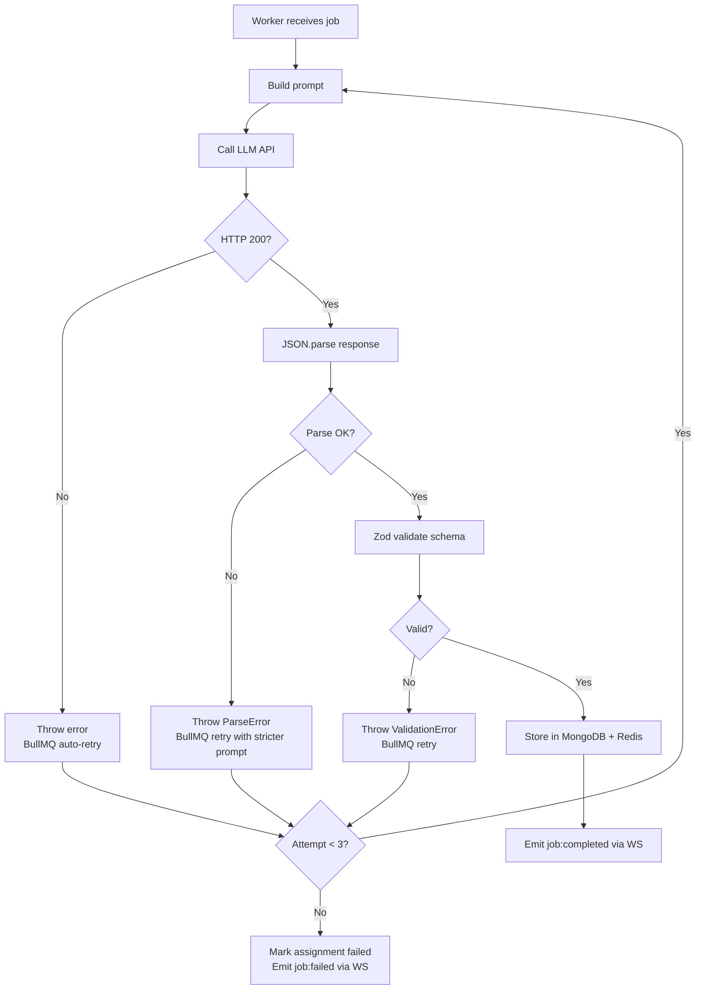

### Prompt Caching (Bonus)

Before calling the LLM, the worker computes a deterministic hash of the generation inputs:

```typescript
const hash = sha256(JSON.stringify({
  subject, topic, grade, questionTypes, difficulty, instructions
}));
const cacheKey = `prompt:cache:${hash}`;
```

If `redis.get(cacheKey)` returns a hit, the worker skips the LLM call entirely and uses the cached paper (TTL: 24 hours).

---

## 11. Infrastructure & DevOps

### Docker Compose (Local Development)

```yaml
# docker-compose.yml
version: '3.9'
services:
  mongo:
    image: mongo:7
    ports: ["27017:27017"]
    volumes: ["mongo_data:/data/db"]

  redis:
    image: redis:7-alpine
    ports: ["6379:6379"]
    command: redis-server --save 60 1

volumes:
  mongo_data:
```

### GitHub Actions CI Pipeline

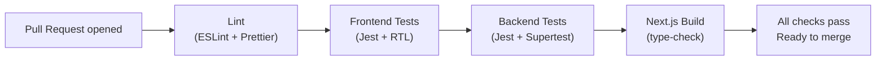

### Deployment Topology (Suggested)

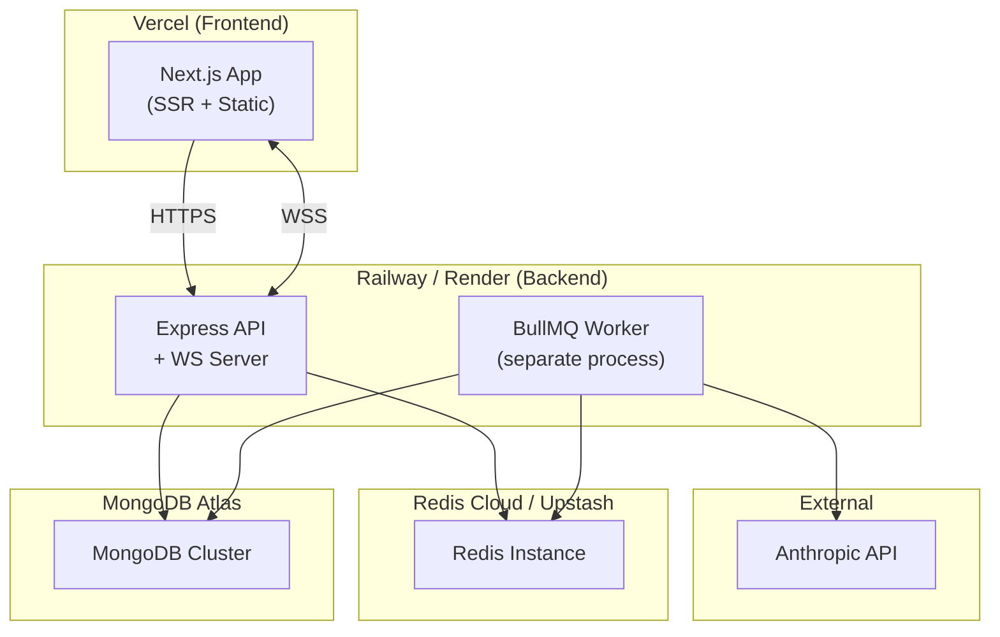

---

## 12. Environment Configuration

### Backend `.env`
```env
# Server
PORT=3001
NODE_ENV=development

# Database
MONGODB_URI=mongodb://localhost:27017/vedaai

# Cache + Queue
REDIS_URL=redis://localhost:6379

# AI
LLM_PROVIDER=anthropic
ANTHROPIC_API_KEY=sk-ant-...
OPENAI_API_KEY=sk-...

# File Upload
UPLOAD_DIR=/tmp/vedaai-uploads
MAX_FILE_SIZE_MB=5

# Rate Limiting
RATE_LIMIT_WINDOW_MS=60000
RATE_LIMIT_MAX=10

# CORS
ALLOWED_ORIGINS=http://localhost:3000
```

### Frontend `.env.local`
```env
NEXT_PUBLIC_API_BASE_URL=http://localhost:3001
NEXT_PUBLIC_WS_URL=ws://localhost:3001
```

---

## 13. Key Technical Decisions

| Decision | Choice | Alternatives Considered | Rationale |
|---|---|---|---|
| Frontend framework | Next.js 14 App Router | Vite + React SPA | SSR for output page SEO; file-based routing reduces boilerplate |
| State management | Zustand | Redux Toolkit, Jotai | Less boilerplate than Redux; more structured than Jotai for this complexity |
| Form validation | React Hook Form + Zod | Formik, Yup | RHF has better performance (uncontrolled); Zod schema shared with backend |
| Job queue | BullMQ | Agenda, simple setInterval | Redis-native; built-in retry/backoff/dead-letter; scales horizontally |
| WebSocket library | Native `ws` | Socket.IO | No need for Socket.IO features (rooms handled manually); smaller bundle |
| LLM output parsing | Zod schema validation | Manual checks | Declarative, throws typed errors, reusable between retry attempts |
| Monorepo | npm workspaces | Turborepo, Nx | Native npm feature; no extra tooling required for this project size |
| PDF export | `@react-pdf/renderer` | Puppeteer | Client-side rendering; no headless browser needed on server |
| Caching layer | Redis (ioredis) | In-memory Map | Survives process restarts; shared across horizontally scaled workers |
| LLM provider | Anthropic Claude 3.5 Sonnet | GPT-4o, Gemini 1.5 | Strongest instruction-following for JSON; fastest response times in class |

---

*End of Document*
